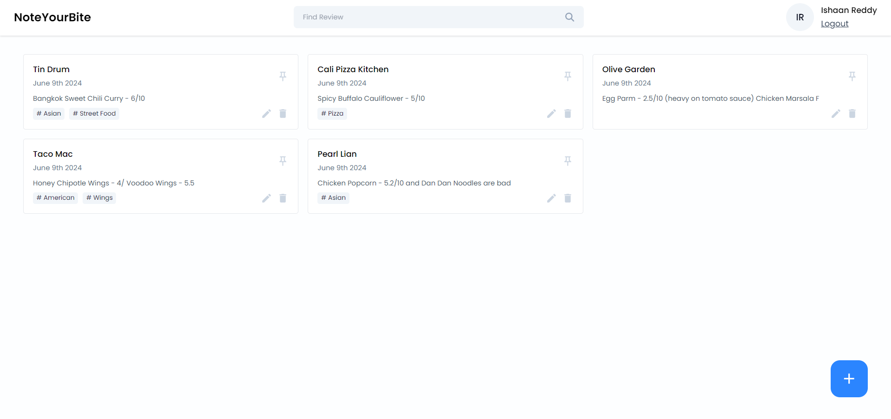
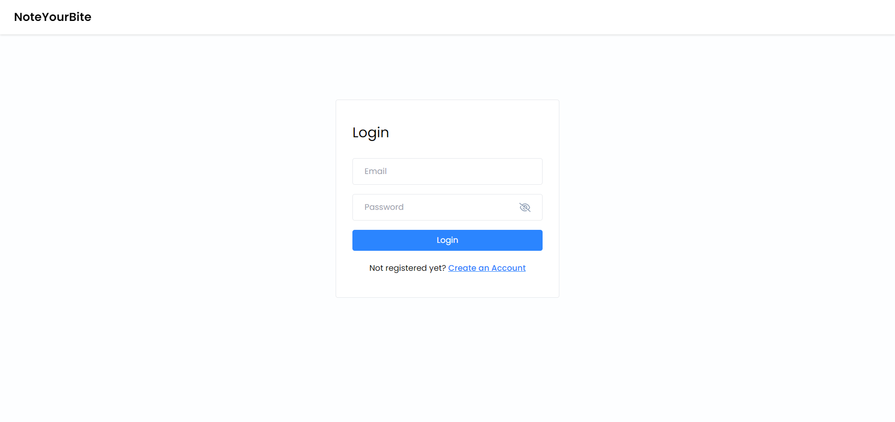
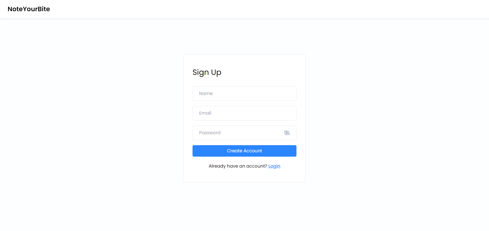
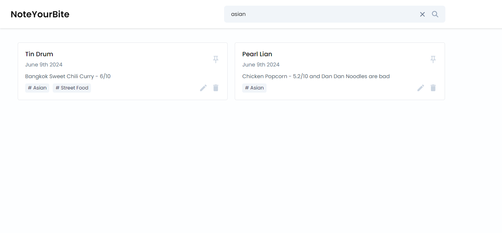
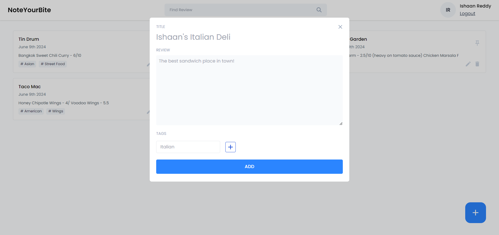

# NoteYourBite

NoteYourBite is a full-stack MERN application designed for users to confidently write and share restaurant ratings.



## Features

- **User Authentication**: Secure login and registration through unique Json Web Tokens.
- **Restaurant Reviews**: Users can add, edit, and delete their restaurant reviews stored on a remote MongoDB database.
- **Responsive Design**: Accessible on various devices with Tailwind Media Queries.

## Technologies Used

- **Frontend**: React, JavaScript
- **Backend**: Node.js, Express
- **Database**: Mongoose, MongoDB
- **Styling**: Taiwind CSS, HTML

## Implementation









Navigate to the implementation folder for more screenshots.

## Installation

1. Clone the repository:
    ```bash
    git clone https://github.com/Git-haan/NoteYourBite.git
    ```
2. Navigate to the project directory:
    ```bash
    cd NoteYourBite
    ```
3. Install dependencies for both frontend and backend:
    ```bash
    cd backend && npm install
    cd ../frontend && npm install
    ```
4. Start the development server:
    ```bash
    cd ../backend && npm start
    cd ../frontend && npm start
    ```
